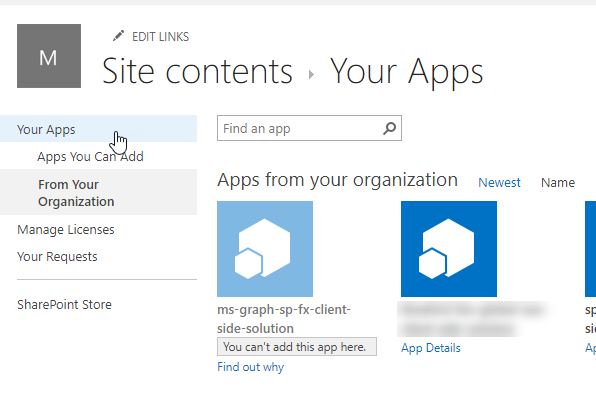
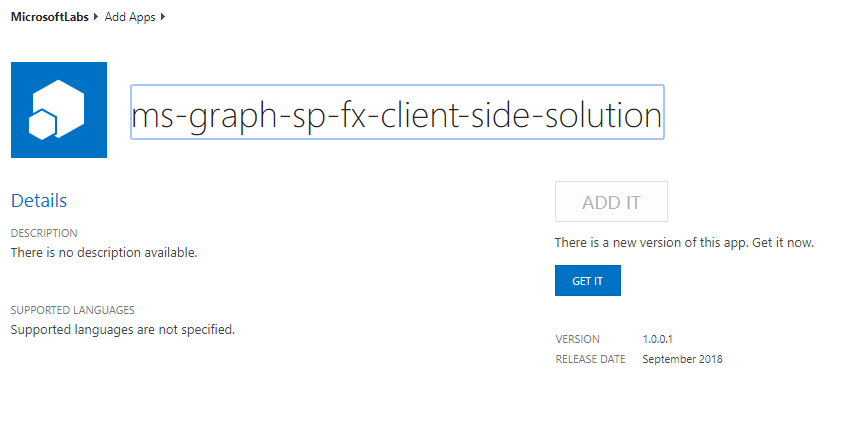

# Demo: Show calendar events from Microsoft Graph in SPFx client-side web part

In this demo you will show a new SPFx project with a single client-side web part that uses React, [Fabric React](https://developer.microsoft.com/fabric) and the Microsoft Graph to display the currently logged in user's calendar events in a familiar office [List](https://developer.microsoft.com/fabric#/components/list).

## Running the demo

1. Open a command prompt and change directory to the root of the application.
1. Execute the following command to download all necessary dependencies

    ```shell
    npm instal
    ```

1. Create the SharePoint package for deployment:
    1. Build the solution by executing the following on the command line:

        ```shell
        gulp build
        ```

    1. Bundle the solution by executing the following on the command line:

        ```shell
        gulp bundle --ship
        ```

    1. Package the solution by executing the following on the command line:

        ```shell
        gulp package-solution --ship
        ```

1. Deploy and trust the SharePoint package:
    1. In the browser, navigate to your SharePoint Online Tenant App Catalog.

        >Note: Creation of the Tenant App Catalog site is one of the steps in the **[Getting Started > Set up Office 365 Tenant](https://docs.microsoft.com/sharepoint/dev/spfx/set-up-your-developer-tenant)** setup documentation.

    1. Select the **Apps for SharePoint** link in the navigation:

        

    1. Drag the generated SharePoint package from **\sharepoint\solution\ms-graph-sp-fx.sppkg** into the **Apps for SharePoint** library.
        1. If you previously uploaded the same package, as in the case from exercise 1, if the **A file with the same name already exists** dialog, select the **Replace It** button.
    1. In the **Do you trust ms-graph-sp-fx-client-side-solution?** dialog, select **Deploy**.

        

1. Approve the API permission request:
    1. Navigate to the SharePoint Admin Portal located at **https://{{REPLACE_WITH_YOUR_TENANTID}}-admin.sharepoint.com/_layouts/15/online/AdminHome.aspx**, replacing the domain with your SharePoint Online's administration tenant URL.

        >Note: At the time of writing, this feature is only in the SharePoint Online preview portal.

    1. In the navigation, select **Advanced > API Management**:

        

    1. Select the **Pending approval** for the **Microsoft Graph** permission **Calendars.Read**.

        

    1. Select the **Approve or Reject** button, followed by selecting **Approve**.

        

1. Test the web part:

    >NOTE: The SharePoint Framework includes a locally hosted & SharePoint Online hosted workbench for testing custom solutions. However, the workbench will not work the first time when testing solutions that utilize the Microsoft due to nuances with how the workbench operates and authentication requirements. Therefore, the first time you test a Microsoft Graph enabled SPFx solution, you will need to test them in a real modern page.
    >
    >Once this has been done and your browser has been cookied by the Azure AD authentication process, you can leverage local webserver and SharePoint Online-hosted workbench for testing the solution.

    1. If this is an update to the existing package you will need to first update the app in your site collection.
        1. In a browser, navigate to a SharePoint Online site.
        1. In the site navigation, select **Add an app**.
        1. Select **From your Organization**. Find your solution which indicates you can't add the app, Click on **Find out why**.

            

        1. Note the indicator showing that there is a new version of the app. Select **GET IT**.

            

    1. Setup environment to test the web part on a real SharePoint Online modern page:
        1. In the site navigation, select the **Pages** library.
        1. Select an existing page (*option 2 in the following image*), or create a new page (*option 1 in the following image*) in the library to test the web part on.

            

            *Continue with the test by skipping the next section to add the web part to the page.*

    1. Setup environment to test the from the local webserver and hosted workbench:
        1. In the command prompt for the project, execute the following command to start the local web server:

            ```shell
            gulp serve --nobrowser
            ```

        1. In a browser, navigate to one of your SharePoint Online site's hosted workbench located at **/_layouts/15/workbench.aspx**

    1. Add the web part to the page and test:
        1. In the browser, select the Web part icon button to open the list of available web parts:

            

        1. Locate the **GraphEventList** web part and select it

            

        1. When the page loads, notice after a brief delay, it will display the current user's calendar events in the list

            