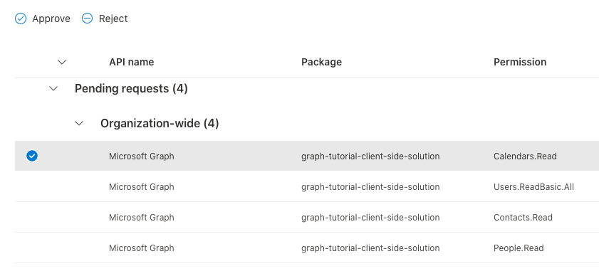
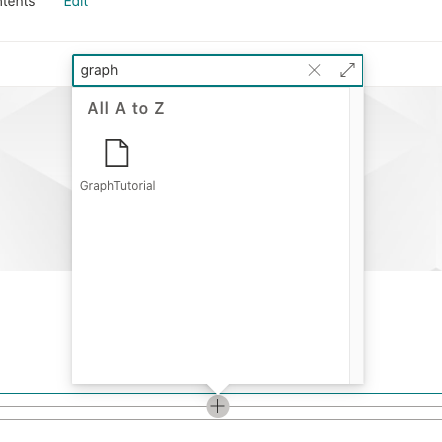
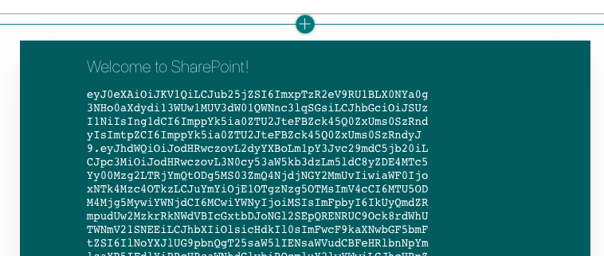

<!-- markdownlint-disable MD002 MD041 -->

The SharePoint Framework eliminates the need to register an application in Azure AD for getting access tokens to access Microsoft Graph. It handles the authentication for the user that is logged into SharePoint, allowing your web part to get user tokens. Your web part needs to indicate which [Graph permission scopes](https://docs.microsoft.com/graph/permissions-reference) it requires, and a tenant admin can approve those permissions during installation.

## Configure permissions

1. Open **./config/package-solution.json**.

1. Add the following code to the `solution` property.

    ```json
    "webApiPermissionRequests": [
      {
        "resource": "Microsoft Graph",
        "scope": "Calendars.ReadWrite"
      },
      {
        "resource": "Microsoft Graph",
        "scope": "User.ReadBasic.All"
      },
      {
        "resource": "Microsoft Graph",
        "scope": "Contacts.Read"
      },
      {
        "resource": "Microsoft Graph",
        "scope": "People.Read"
      }
    ]
    ```

The `Calendars.ReadWrite` permission allows your web part to retrieve the user's calendar and add events using Microsoft Graph. The other permissions are used by components in the Microsoft Graph Toolkit to render information about event attendees and organizers.

## Optional: Test token acquisition

> [!NOTE]
> The rest of the steps on this page are optional. If you'd prefer to get to the Microsoft Graph coding right away, you can proceed to [Get a calendar view](/graph/tutorials/spfx?tutorial-step=3).

Let's add some temporary code to the web part to test token acquisition.

1. Open **./src/webparts/graphTutorial/GraphTutorialWebPart.ts** and add the following `import` statement at the top of the file.

    ```typescript
    import { AadTokenProvider } from '@microsoft/sp-http';
    ```

1. Replace the existing `render` function with the following.

    ```typescript
    public render(): void {
    this.context.aadTokenProviderFactory
      .getTokenProvider()
      .then((provider: AadTokenProvider)=> {
      provider
        .getToken('https://graph.microsoft.com')
        .then((token: string) => {
          this.domElement.innerHTML = `
          <div class="${ styles.graphTutorial }">
            <div class="${ styles.container }">
              <div class="${ styles.row }">
                <div class="${ styles.column }">
                  <span class="${ styles.title }">Welcome to SharePoint!</span>
                  <p><code style="word-break: break-all;">${ token }</code></p>
                </div>
              </div>
            </div>
          </div>`;
        });
      });
    }
    ```

### Deploy the web part

1. Run the following two commands in your CLI to build and package your web part.

    ```Shell
    gulp bundle --ship
    gulp package-solution --ship
    ```

1. Open your browser and go to your tenant's SharePoint App Catalog. Select the **Apps for SharePoint** menu item on the left-hand side.

1. Upload the **./sharepoint/solution/graph-tutorial.sppkg** file.

1. In the **Do you trust...** prompt, confirm that the prompt lists the 4 Microsoft Graph permissions you set in the **package-solution.json** file. Select **Make this solution available to all sites in the organization**, then select **Deploy**.

1. Go to the [SharePoint admin center](https://admin.microsoft.com/sharepoint?page=classicfeatures&modern=true) using a tenant administrator.

1. In the left-hand menu, select **Advanced**, then **API access**.

1. Select each of the pending requests from the **graph-tutorial-client-side-solution** package and choose **Approve**.

    

### Test the web part

1. Go to a SharePoint site where you want to test the web part. Create a new page to test the web part on.

1. Use the web part picker to find the **GraphTutorial** web part and add it to the page.

    

1. The access token is printed below the **Welcome to SharePoint!** message in the web part. You can copy this token and parse it at [https://jwt.ms/](https://jwt.ms/) to confirm that it contains the permission scopes required by the web part.

    
