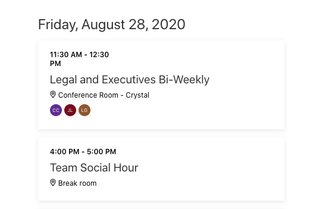

<!-- markdownlint-disable MD002 MD041 -->

In this section you'll update the web part to allow the user to add an event to their calendar for the team's weekly social hour. In this scenario, the team has a weekly social hour at 4 PM on Friday.

1. Open **./src/webparts/graphTutorial/GraphTutorialWebPart.ts** and replace the existing `addSocialToCalendar()` method with the following.

    :::code language="typescript" source="../demo/graph-tutorial/src/webparts/graphTutorial/GraphTutorialWebPart.ts" id="addSocialToCalendarSnippet":::

    Consider what this code does.

    - It determines the next upcoming Friday and constructs a **Date** for 4 PM on that day.
    - It constructs a new **MicrosoftGraph.Event** object, setting the start to the value of the **Date**, and the end for one hour later.
    - It uses the **MSGraphClient** to POST the new event to the `/me/events` endpoint.
    - It re-renders the web part so the view is updated with the new event.

1. Build, package, and re-upload the web part, then refresh the page where you are testing it.

1. Click the **Add team social** button. Once the page refreshes, scroll down to Friday and find the new event.

    
